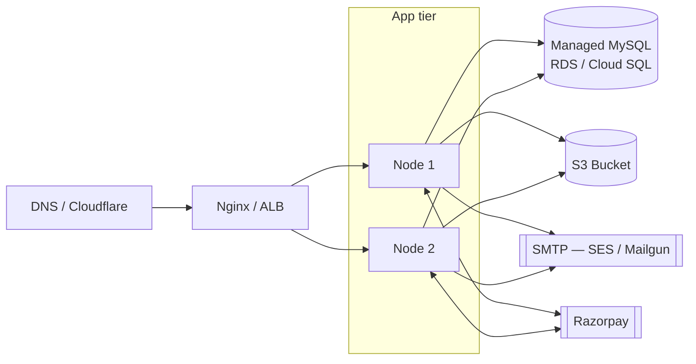

# Expense App — Deployment Guide

Two paths:
1. **Local development** — fastest path, with Docker for the DB.
2. **Production** — Docker image on a single VPS or container service, with S3 + SMTP + a managed MySQL.

---

## 1. Local development

### 1.1 Prerequisites

- Node.js 22.x
- Docker Desktop (for MySQL, optional if you have a local MySQL)
- Razorpay test account (for the payment flow) — sign up at https://dashboard.razorpay.com

### 1.2 First-time setup

```bash
git clone <repo>
cd Expense-App

# Backend
cp .env.example .env
# Edit .env: at minimum set RAZORPAY_KEY_ID, RAZORPAY_KEY_SECRET, JWT_SECRET (32+ chars)

# One command for DB + backend
docker compose up -d --build

# Frontend
cd frontend
npm install
npm run dev   # http://localhost:5173
```

The backend listens on `localhost:3000`, MySQL on `localhost:3308` (mapped from container's 3306). Vite's dev proxy forwards `/api/*` and `/uploads/*` to the backend, so the SPA hits the same origin in dev — no CORS issues.

### 1.3 Without Docker

If you have a local MySQL already:

```bash
# In MySQL
CREATE DATABASE expense_app CHARACTER SET utf8mb4 COLLATE utf8mb4_unicode_ci;

# In .env, point at the local MySQL
DB_HOST=127.0.0.1
DB_PORT=3306
DB_NAME=expense_app
DB_USER=<your_user>
DB_PASSWORD=<your_password>

# Run backend
npm install
npm run dev
```

### 1.4 Useful commands

```bash
# Tail backend logs
docker compose logs -f backend

# Reset everything
docker compose down -v && docker compose up -d --build

# Connect to MySQL
docker compose exec db mysql -uapp -papppass expense_app

# Smoke test: signup
curl -X POST http://localhost:3000/api/auth/signup \
  -H "Content-Type: application/json" \
  -d '{"name":"Test","email":"test@example.com","password":"Test1234"}'
```

---

## 2. Environment variables (every one)

### Required (no defaults — boot fails without them)

| Var                    | Notes                                        |
|------------------------|----------------------------------------------|
| `DB_HOST`              | MySQL host                                   |
| `DB_NAME`              |                                              |
| `DB_USER`              |                                              |
| `DB_PASSWORD`          |                                              |
| `JWT_SECRET`           | **>= 32 chars** — checked at boot            |
| `RAZORPAY_KEY_ID`      | Public key id (`rzp_test_...` / `rzp_live_...`) |
| `RAZORPAY_KEY_SECRET`  | **Server-side secret — never expose**        |

### With sensible defaults

| Var                       | Default                                     | Notes                                  |
|---------------------------|---------------------------------------------|----------------------------------------|
| `NODE_ENV`                | `development`                               | `production` strips error stacks       |
| `PORT`                    | `3000`                                      |                                        |
| `CORS_ORIGIN`             | `http://localhost:5173`                     | Single allowed origin                  |
| `DB_PORT`                 | `3306`                                      |                                        |
| `JWT_EXPIRES_IN`          | `7d`                                        |                                        |
| `PREMIUM_AMOUNT_PAISE`    | `50000`                                     | ₹500                                   |
| `PREMIUM_CURRENCY`        | `INR`                                       |                                        |
| `EMAIL_DRIVER`            | `console`                                   | `smtp` for prod                        |
| `EMAIL_FROM`              | `Expense App <noreply@expense.app>`         |                                        |
| `PASSWORD_RESET_URL`      | `http://localhost:5173/reset-password`      | Used in the email template             |
| `STORAGE_DRIVER`          | `local`                                     | `s3` for prod                          |
| `LOCAL_UPLOAD_PATH`       | `./uploads`                                 |                                        |
| `AWS_REGION`              | `ap-south-1`                                |                                        |
| `RATE_LIMIT_WINDOW_MS`    | `900000` (15 min)                           |                                        |
| `RATE_LIMIT_MAX_REQUESTS` | `100`                                       |                                        |
| `LOG_LEVEL`               | `info`                                      | `debug` / `warn` / `error`             |

### Required only when their feature is enabled

`EMAIL_DRIVER=smtp` requires:
- `SMTP_HOST`
- `SMTP_PORT`
- `SMTP_USER`
- `SMTP_PASS`
- (optional) `SMTP_SECURE` — defaults to `true`

`STORAGE_DRIVER=s3` requires:
- `AWS_ACCESS_KEY_ID`
- `AWS_SECRET_ACCESS_KEY`
- `AWS_BUCKET_NAME`
- (optional) `AWS_S3_ENDPOINT` — for MinIO-compatible
- (optional) `AWS_S3_FORCE_PATH_STYLE` — `true` for MinIO

The `config/env.js` Zod schema enforces all of this **at boot**. A misconfigured deploy fails immediately, not three hours later when a user tries to upload a file.

---

## 3. Production deployment

### 3.1 Architecture



### 3.2 Steps (a single VPS)

```bash
# 1. Provision a VPS (Ubuntu 22.04). Open ports 80, 443, 22.
# 2. Install Docker + docker-compose plugin.
# 3. Get a domain pointed at the VPS, install certbot for SSL.

# 4. On the VPS:
git clone <repo>
cd Expense-App
cp .env.example .env
nano .env   # fill in production values

# 5. Build the prod image
docker compose build backend

# 6. Bring up
docker compose up -d
```

For **SSL termination**, run nginx in front of the backend on the host:

```nginx
server {
    listen 443 ssl http2;
    server_name expense.example.com;

    ssl_certificate     /etc/letsencrypt/live/expense.example.com/fullchain.pem;
    ssl_certificate_key /etc/letsencrypt/live/expense.example.com/privkey.pem;

    client_max_body_size 30M;

    location /api {
        proxy_pass http://localhost:3000;
        proxy_set_header Host $host;
        proxy_set_header X-Real-IP $remote_addr;
        proxy_set_header X-Forwarded-For $proxy_add_x_forwarded_for;
        proxy_set_header X-Forwarded-Proto $scheme;
    }

    location /healthz {
        proxy_pass http://localhost:3000/healthz;
    }

    location / {
        root /var/www/expense-frontend;   # frontend `npm run build` output
        try_files $uri /index.html;
    }
}
```

The `app.js` already calls `app.set('trust proxy', 1)` so the rate limiter sees the real client IP from `X-Forwarded-For`.

### 3.3 Production env example

```bash
NODE_ENV=production
PORT=3000
CORS_ORIGIN=https://expense.example.com

DB_HOST=db.<region>.rds.amazonaws.com
DB_PORT=3306
DB_NAME=expense_app
DB_USER=expense_app
DB_PASSWORD=<from secrets manager>

JWT_SECRET=<openssl rand -base64 64>
JWT_EXPIRES_IN=7d

RAZORPAY_KEY_ID=rzp_live_xxxxxxxxxx
RAZORPAY_KEY_SECRET=<from secrets manager>
PREMIUM_AMOUNT_PAISE=50000
PREMIUM_CURRENCY=INR

EMAIL_DRIVER=smtp
SMTP_HOST=email-smtp.us-east-1.amazonaws.com
SMTP_PORT=465
SMTP_SECURE=true
SMTP_USER=<from secrets manager>
SMTP_PASS=<from secrets manager>
EMAIL_FROM="Expense App <noreply@example.com>"
PASSWORD_RESET_URL=https://expense.example.com/reset-password

STORAGE_DRIVER=s3
AWS_ACCESS_KEY_ID=<from secrets manager>
AWS_SECRET_ACCESS_KEY=<from secrets manager>
AWS_REGION=ap-south-1
AWS_BUCKET_NAME=expense-app-prod-uploads

RATE_LIMIT_WINDOW_MS=900000
RATE_LIMIT_MAX_REQUESTS=100
LOG_LEVEL=info
```

---

## 4. Database setup (production)

### 4.1 Create the DB

```sql
CREATE DATABASE expense_app CHARACTER SET utf8mb4 COLLATE utf8mb4_unicode_ci;

CREATE USER 'expense_app'@'%' IDENTIFIED BY '<strong-password>';
GRANT SELECT, INSERT, UPDATE, DELETE, CREATE, ALTER, INDEX, DROP, REFERENCES
  ON expense_app.* TO 'expense_app'@'%';
FLUSH PRIVILEGES;
```

We grant DDL (`CREATE/ALTER/DROP/INDEX`) only because in dev `sequelize.sync({ alter: true })` runs at boot. In a stricter prod setup you'd:

1. Run schema migrations as a separate one-shot job (e.g. `umzug` or Sequelize CLI) using a dedicated migration user with DDL.
2. The runtime app user has only DML (`SELECT/INSERT/UPDATE/DELETE`) — much smaller blast radius if creds leak.

### 4.2 Schema sync vs migrations

`server.js` has:

```js
await sequelize.sync({ alter: env.NODE_ENV === 'development' });
```

So in `production` it runs `sync()` without `alter` — i.e. it creates missing tables but doesn't try to ALTER existing ones. For a real prod deployment, replace this with explicit migrations:

```bash
npm i -D sequelize-cli umzug
npx sequelize-cli init
# move schema diffs into migrations/
npx sequelize-cli db:migrate
```

Then remove `sequelize.sync()` from `server.js` entirely.

---

## 5. S3 setup

### 5.1 Bucket creation

```bash
aws s3 mb s3://expense-app-prod-uploads --region ap-south-1
```

### 5.2 IAM policy (least privilege)

```json
{
  "Version": "2012-10-17",
  "Statement": [{
    "Effect": "Allow",
    "Action": ["s3:PutObject", "s3:GetObject"],
    "Resource": "arn:aws:s3:::expense-app-prod-uploads/*"
  }]
}
```

The IAM user attached to the app **only** has `PutObject` + `GetObject`. No `ListBucket`, no `DeleteObject`. (Add `DeleteObject` only when you implement a delete-receipt feature.)

### 5.3 CORS on the bucket (so the browser can presigned-PUT)

```json
[{
  "AllowedHeaders": ["*"],
  "AllowedMethods": ["PUT", "GET"],
  "AllowedOrigins": ["https://expense.example.com"],
  "ExposeHeaders": ["ETag"],
  "MaxAgeSeconds": 3000
}]
```

### 5.4 Public access policy

Keep the bucket **private**. Pre-signed URLs grant temporary access; never make the bucket public. If you want CDN-served reports later, use CloudFront with an Origin Access Identity instead.

### 5.5 Lifecycle policy

If you want receipts auto-archived to Glacier after 90 days:

```json
{
  "Rules": [{
    "ID": "archive-receipts",
    "Status": "Enabled",
    "Filter": { "Prefix": "receipts/" },
    "Transitions": [
      { "Days": 90, "StorageClass": "GLACIER" }
    ]
  }]
}
```

---

## 6. SMTP setup

### 6.1 Gmail (small scale, dev / staging)

Generate an **App Password** at https://myaccount.google.com/apppasswords (requires 2FA on the account).

```
EMAIL_DRIVER=smtp
SMTP_HOST=smtp.gmail.com
SMTP_PORT=465
SMTP_SECURE=true
SMTP_USER=your.address@gmail.com
SMTP_PASS=<the 16-char app password>
EMAIL_FROM="Your Name <your.address@gmail.com>"
```

Gmail caps at ~500 emails/day. Fine for personal projects, not for production.

### 6.2 Amazon SES (production)

1. Verify a domain in SES.
2. Move out of the "sandbox" by submitting a production-access request.
3. Create SMTP credentials in the SES console.

```
SMTP_HOST=email-smtp.ap-south-1.amazonaws.com
SMTP_PORT=465
SMTP_SECURE=true
SMTP_USER=<SES SMTP username>
SMTP_PASS=<SES SMTP password>
EMAIL_FROM="Expense App <noreply@yourdomain.com>"
```

### 6.3 Mailgun / SendGrid

Same shape — different host/port. The `nodemailer` SMTP transport is provider-agnostic.

---

## 7. Razorpay setup

### 7.1 Test mode

1. Sign up at https://dashboard.razorpay.com.
2. **Account & Settings → API Keys** → generate a test key.
3. Put `key_id` and `key_secret` in `.env`.
4. The test mode generates a real-looking checkout but only test cards / UPI IDs work:
   - Test card: `5267 3181 8797 5449`, any future expiry, any CVV, OTP `1234`
   - Test UPI: `success@razorpay`

### 7.2 Live mode

Requires KYC: business name, PAN, GST (if applicable), bank account details. Razorpay reviews and approves typically within 1-3 business days.

Once live:
- Replace `rzp_test_...` keys with `rzp_live_...` in `.env`.
- The frontend automatically uses the new keys (it reads `keyId` from the order response).
- Webhook URL: in Razorpay dashboard, configure `https://expense.example.com/api/payments/webhook` (this endpoint is **not yet implemented** — see HLD.md §10 for the design).

---

## 8. Operational concerns

### 8.1 Health checks

`GET /healthz` returns `200 { status: 'ok' }`. Configure your load balancer's health check to hit this. Add a `SELECT 1` ping to the DB before considering this production-grade — currently it doesn't actually verify DB connectivity at request time.

### 8.2 Graceful shutdown

`server.js` handles `SIGTERM` and `SIGINT`:

```js
const shutdown = (signal) => {
  server.close(async () => {
    await sequelize.close();
    process.exit(0);
  });
};
```

`server.close()` stops accepting new connections and waits for in-flight requests to finish. Set the orchestrator's grace period (Kubernetes `terminationGracePeriodSeconds`, ECS `stopTimeout`) to **at least 30s** so longer requests can complete.

### 8.3 Logging in production

The Winston logger emits one JSON object per line in production:

```json
{"timestamp":"2026-05-10T12:34:56.789Z","level":"info","message":"server listening on port 3000 [production]"}
```

Pipe stdout into your aggregator: CloudWatch Logs, Datadog, Loki, ELK. Searchable on `level`, `event`, `userId`, etc.

### 8.4 Backups

Managed MySQL (RDS) does automatic daily backups with point-in-time recovery. Verify backup restoration **at least once** before you need it — un-tested backups are not backups.

### 8.5 Monitoring & alerting

Minimum signals:
- **Error rate**: 5xx > 1% of requests over 5 min.
- **Latency**: API p95 > 500ms.
- **Payment success rate**: < 95% — usually a sign Razorpay credentials or the webhook is broken.
- **Database connections**: pool > 80% utilised.
- **Disk** (for local upload driver): < 10% free.

Stand up these alerts on day one, not after the first incident.

---

## 9. Deployment checklist

Before flipping a deployment to production, confirm:

- [ ] `JWT_SECRET` is unique, 32+ chars, **not the dev value**.
- [ ] `RAZORPAY_KEY_ID` is a `rzp_live_*` key (not test).
- [ ] `CORS_ORIGIN` is set to the real frontend domain.
- [ ] HTTPS is enforced (HSTS header, redirect from :80).
- [ ] `.env` is **not** in the git repo (it's in `.gitignore` — verify with `git ls-files | grep .env`).
- [ ] Database backups verified — one practice restore done.
- [ ] S3 bucket is **private**; CORS is locked to the frontend domain.
- [ ] SMTP `EMAIL_FROM` matches a verified domain (DKIM + SPF records published).
- [ ] Rate limiter store is shared across instances if running >1 process (swap to Redis).
- [ ] `requirePremium` confirmed working — non-premium user gets 403 on `/api/premium/*`.
- [ ] `/healthz` is reachable and the LB health check is wired to it.
- [ ] Logs are flowing to your aggregator.
- [ ] Alerts are configured (error rate, latency, payment success, DB pool, disk).

---

## 10. Rollback

If a deployment goes wrong:

```bash
# 1. Identify the last known-good commit
git log --oneline -20

# 2. Roll back the image
git checkout <good-sha>
docker compose build backend
docker compose up -d backend

# 3. If a migration was applied that's incompatible — roll forward, don't roll back
# (rolling back a destructive migration usually means data loss).
```

The frontend is just static files — keeping the previous build artifact lets you `cp -r` it back into nginx's web root.

---

## 11. Cost estimate (single-VPS prod, low traffic)

| Component                | Provider             | ~Monthly |
|--------------------------|----------------------|---------:|
| VPS (1 vCPU, 1GB RAM)    | Hetzner / DO         |    €5-7  |
| Domain                   | Namecheap            |    ~$1   |
| Cloudflare DNS / TLS     | Cloudflare           |    Free  |
| MySQL (db.t4g.micro RDS) | AWS                  |   ~$15   |
| S3 storage (10 GB)       | AWS                  |    ~$0.25 |
| SES (1000 emails)        | AWS                  |    ~$0.10 |
| Razorpay fees            | Razorpay             | 2% per txn |

So roughly **$22-25/month** + payment processing fees, which is well below "side project that pays for itself" territory if you ever charge real users.
