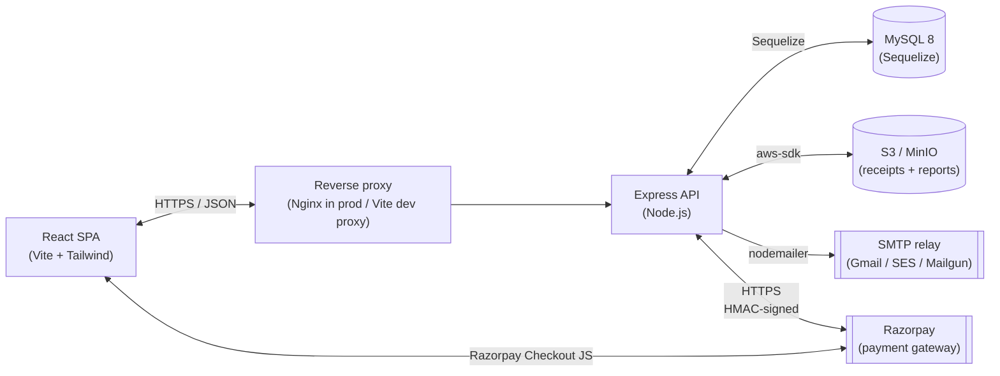
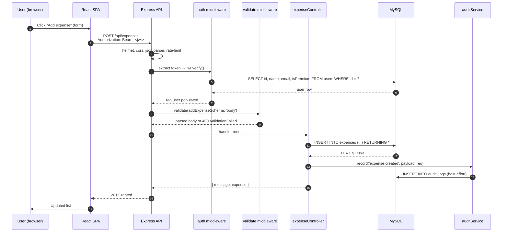
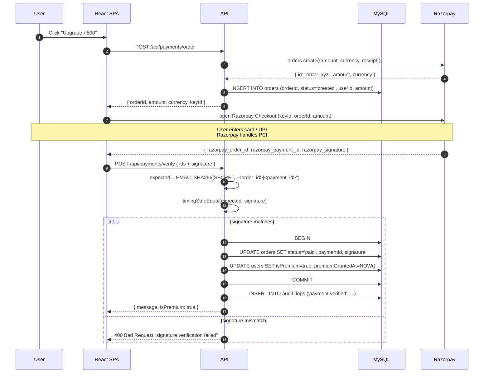
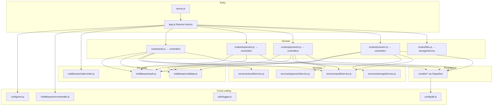
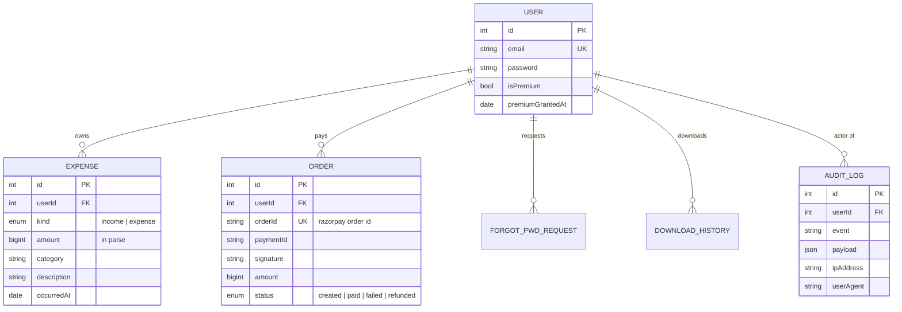

# Expense App — High-Level Design (HLD)

This doc explains *what the system looks like* and *how requests flow through it*, at the architecture level. The companion [LLD.md](./LLD.md) covers the actual algorithms (HMAC verification, audit logging, etc.) and DB schema details.

---

## 1. System overview

Expense App is a small SaaS-shaped service: **users sign up, log financial events, optionally upgrade to a paid tier, and pull reports**. Despite the simple feature set, the back-of-the-envelope architecture has the same pieces a real B2C product has — auth, payments, file storage, email, audit, rate limiting — so it's a useful blueprint.

Two important things to notice in this diagram:

1. The **browser talks to Razorpay directly** for the actual checkout step (card data never touches our server — PCI scope stays at zero).
2. The **API talks to Razorpay** independently to (a) create the order and (b) verify the HMAC signature after the user pays.

---

## 2. Tech choices and why

| Choice                              | Why                                                                                   |
|-------------------------------------|--------------------------------------------------------------------------------------|
| **Node.js + Express**               | Familiar, fast iteration; ecosystem for everything we need (Sequelize, Razorpay SDK). |
| **MySQL via Sequelize**             | Strong transactions for payment+grant flow; relational data fits expenses naturally.  |
| **JWT (HS256)**                     | Stateless auth — API horizontally scalable without a session store.                  |
| **Re-fetch user on every request**  | Token doesn't carry `isPremium`. Avoids stale-claim bug after upgrade/refund.        |
| **Zod**                             | Single source of truth for request validation **and** env validation.                 |
| **Razorpay**                        | Indian payment gateway with great docs; HMAC signature verification is well-defined.  |
| **Pluggable storage / email**       | Same code path runs on dev (local FS, console email) and prod (S3, SMTP).             |
| **Helmet + rate limiter + audit**   | Defense-in-depth — none of these are sufficient alone, all three matter.              |
| **Docker + docker-compose**         | One-command boot; matches the prod container image exactly.                           |

---

## 3. Request lifecycle (end-to-end)

What happens when an authenticated user adds an expense:

The chain `helmet → cors → json → rate-limit → authenticate → validate → controller → errorHandler` is the same for **every** authenticated route. New endpoints don't need to re-implement any of it.

---

## 4. Payment flow (the interesting one)

The original v1 of this app had a serious bug: the verify endpoint trusted the client-supplied `status` field, so any logged-in user could become premium for free. The current design fixes that with **HMAC signature verification on every payment**.

Key invariants:

- **Idempotency**: if `orders.status === 'paid'` already, we return success without re-granting premium. Replays don't double-charge or double-grant.
- **Atomicity**: order update and user upgrade run in a single Sequelize transaction. If either fails, neither happens.
- **Constant-time comparison**: `crypto.timingSafeEqual` rather than `===` — closes a theoretical timing side-channel.

---

## 5. Module / package structure

**Why this shape?** Controllers only orchestrate. Side-effects (email, storage, payments, audit) live in `services/` and can be swapped in tests. Cross-cutting concerns (auth, validation, rate-limit) are middleware so they're applied uniformly without each handler re-implementing them.

---

## 6. Data model (high-level)

Detailed schema lives in [LLD.md](./LLD.md). The relationships:

Constraints worth highlighting:

- `User.email` is UNIQUE.
- `Order.orderId` is UNIQUE — guarantees idempotency on payment verification.
- `Expense (userId, occurredAt)` is indexed — date-range queries are common.
- `Expense (userId, kind)` is indexed — leaderboard sums only `kind='expense'`.
- `AuditLog.userId` is `ON DELETE SET NULL` — we keep audit history even if a user is deleted.

---

## 7. Failure modes and how they're handled

| Failure                                    | What happens                                                              |
|--------------------------------------------|---------------------------------------------------------------------------|
| Forged Razorpay signature                  | `verifySignature()` returns false → 400, no DB writes                     |
| User refreshes after paying                | Idempotent — `orders.status === 'paid'` → returns success without re-grant |
| MySQL is down                              | `connect()` fails on boot → process exits (Docker restarts)               |
| SMTP is down                               | Reset email throws → user sees generic error; the request token row stays valid for retries (could be replayed, OK because it's single-use & expires) |
| Audit write fails                          | Caught and logged at `warn`. Business op continues.                       |
| Bad JWT / expired                          | `jwt.verify` throws → errorHandler maps to 401                            |
| Stale `isPremium` claim                    | Eliminated — we always re-read user from DB                               |
| Path-traversal upload key                  | `path.basename(decoded)` strips dirs, then we assert resolved path is inside upload dir |
| File over size cap                         | Per-mime cap rejects in `getUploadUrl`; raw upload route also caps at `ABSOLUTE_MAX_BYTES` |
| Spike of brute-force logins                | `authLimiter` (10 / 15min per IP) returns 429                             |

---

## 8. Scaling notes (what would change at higher load)

This isn't built for FAANG scale, but it's structured so the next stop is reasonable:

- **Stateless API → horizontal scale**. Run `N` Node processes behind a load balancer. JWTs are HS256 — every node verifies independently with the same secret.
- **MySQL is the bottleneck first**. Read replicas for the dashboard query; primary stays for writes.
- **CSV reports**: today they generate inline in the request. Past ~10K rows, push to a queue (BullMQ / SQS) and email the user a link when the worker finishes.
- **Audit table grows forever**. Hot/cold split: keep last 90 days hot, archive older to cold storage (cheap S3 + Athena). The Group-Chat-App in this same portfolio actually demonstrates this hot/warm/cold pattern.
- **Multi-region / latency**. Razorpay and SMTP are external; their latency is the wall. Cache the Razorpay public key, batch audit writes if they ever become hot (they aren't currently — single insert per business event).

---

## 9. Security posture (one-liner each)

- Helmet sets sane HTTP security headers.
- CORS is locked to a single origin (`CORS_ORIGIN` env).
- Three different rate limiters (auth, payment, general).
- bcrypt @ 12 rounds for passwords (~250ms hash → not a timing leak).
- JWT secret minimum length enforced (`>= 32 chars`) at startup.
- HMAC-SHA256 + timing-safe comparison for payments.
- Single-use, time-bound (30 min) password reset tokens.
- Audit log of every financial event with IP + UA.
- File upload size caps **per mime type** (image 10MB, PDF 25MB).
- No path traversal — uploaded keys are `basename`'d and re-asserted inside the upload root.
- `.env` and `uploads/` are gitignored.
- Errors don't leak stacks in production (`NODE_ENV=production`).

---

## 10. What's intentionally not built

These would each be one extra week and add scope without changing the architecture story:

- **Refunds endpoint** — Razorpay supports it; we'd just need a webhook to flip `orders.status='refunded'` and `users.isPremium=false`.
- **Email verification on signup** — same machinery as forgot-password.
- **2FA** — would slot into the auth middleware.
- **Webhooks (vs. just polling on verify)** — current verify is client-driven; a webhook from Razorpay would be the production-correct way.
- **Recurring premium** — currently one-time payment; subscriptions would need Razorpay's subscription API.

The point is: each of these is a **bounded extension**, not a redesign.
