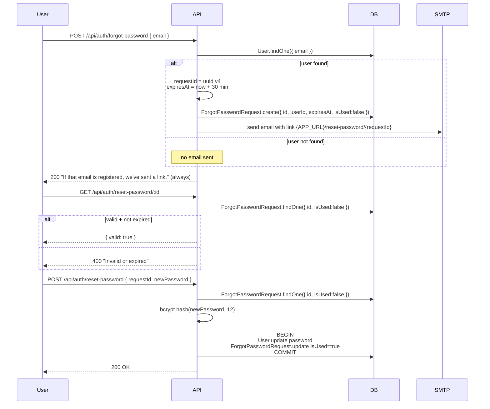

# Expense App — Low-Level Design (LLD)

This doc covers the **how** — the actual data shapes, indexes, and algorithms. The companion [HLD.md](./HLD.md) covers the architecture story.

Reading order: schema first (so you know the data), then the four algorithms that have non-trivial logic (auth, payment verification, password reset, file upload).

---

## 1. Database schema (every table)

All tables use InnoDB / utf8mb4 (set at the Sequelize `define` level). Timestamps are auto-managed by Sequelize.

### `Users`

```sql
id              INT PK AUTO_INCREMENT
name            VARCHAR(100)   NOT NULL
email           VARCHAR(150)   NOT NULL UNIQUE
password        VARCHAR(200)   NOT NULL    -- bcrypt hash
isPremium       BOOLEAN        NOT NULL DEFAULT FALSE
premiumGrantedAt DATETIME      NULL
createdAt       DATETIME       NOT NULL
updatedAt       DATETIME       NOT NULL

INDEX (email UNIQUE)
```

Notes:
- `password` is a bcrypt hash → fixed ~60 chars; column is 200 to keep headroom for future algorithm bumps.
- `premiumGrantedAt` is nullable so a free user has `NULL`, not an epoch-zero timestamp.

---

### `Expenses`

```sql
id              INT PK AUTO_INCREMENT
userId          INT            NOT NULL  -- FK Users.id, ON DELETE CASCADE
kind            ENUM('income','expense') NOT NULL
amount          BIGINT UNSIGNED NOT NULL  -- in paise
description     VARCHAR(255)   NOT NULL
category        ENUM(...)      NOT NULL
receiptUrl      VARCHAR(1000)  NULL
occurredAt      DATE           NOT NULL DEFAULT CURRENT_DATE
createdAt       DATETIME       NOT NULL
updatedAt       DATETIME       NOT NULL

INDEX (userId, occurredAt)
INDEX (userId, kind)
```

Why these choices:

- **`amount BIGINT UNSIGNED`** — money is stored in *paise* (1 INR = 100 paise). Floats would lose precision; `DECIMAL(15,2)` would also work but `BIGINT` is faster for sums and trivially serializable.
- **`kind` enum** — `income` vs `expense` collapses two tables into one. Same shape, same indexes, easy to query as a unified ledger.
- **`category` is an enum**, not a free-text column — keeps the leaderboard / filter UI honest. Zod schema rejects unknown categories at the API boundary too.
- **`occurredAt` is `DATE` (not `DATETIME`)** — the user is recording *which day* the expense was for, not the millisecond. Storing as `DATETIME` would force timezone reasoning we don't need.
- **Composite indexes** match the two hot queries:
  1. Dashboard list & date filter → `(userId, occurredAt)`
  2. Leaderboard sum → `(userId, kind)` (covering for `WHERE userId=? AND kind='expense'`)

---

### `Orders`

```sql
id          INT PK AUTO_INCREMENT
userId      INT            NOT NULL  -- FK Users.id ON DELETE CASCADE
orderId     VARCHAR(100)   NOT NULL UNIQUE  -- razorpay order id
paymentId   VARCHAR(100)   NULL
signature   VARCHAR(255)   NULL
amount      BIGINT UNSIGNED NOT NULL
currency    VARCHAR(3)     NOT NULL DEFAULT 'INR'
status      ENUM('created','paid','failed','refunded') NOT NULL DEFAULT 'created'
createdAt   DATETIME       NOT NULL
updatedAt   DATETIME       NOT NULL

UNIQUE INDEX (orderId)
INDEX (userId, status)
```

The `UNIQUE` on `orderId` is what makes payment verification idempotent — a replayed verify from the same order id finds the existing row and returns success without granting premium twice.

---

### `ForgotPasswordRequests`

```sql
id          VARCHAR(36)    PK              -- uuid v4
userId      INT            NOT NULL  -- FK
isUsed      BOOLEAN        NOT NULL DEFAULT FALSE
expiresAt   DATETIME       NOT NULL
createdAt   DATETIME       NOT NULL
updatedAt   DATETIME       NOT NULL

INDEX (userId)
INDEX (expiresAt)
```

The `id` itself **is the token** mailed to the user. UUIDv4 → 122 bits of entropy → not guessable.

`expiresAt` is indexed because a periodic cleanup job (not yet implemented but trivial to add) would run `DELETE FROM ForgotPasswordRequests WHERE expiresAt < NOW() AND isUsed = TRUE`.

---

### `DownloadHistory`

```sql
id          INT PK AUTO_INCREMENT
userId      INT            NOT NULL
fileUrl     VARCHAR(1000)  NOT NULL
rowCount    INT            NOT NULL DEFAULT 0
sizeBytes   BIGINT UNSIGNED NULL
createdAt   DATETIME       NOT NULL

INDEX (userId, createdAt)
```

Every CSV report writes a row here so the user can re-download the last N reports, and so we can throttle abuse if needed.

---

### `AuditLogs`

```sql
id          INT PK AUTO_INCREMENT
userId      INT            NULL   -- FK Users.id ON DELETE SET NULL
event       VARCHAR(100)   NOT NULL  -- 'user.login', 'expense.created', ...
payload     JSON           NULL
ipAddress   VARCHAR(45)    NULL
userAgent   VARCHAR(255)   NULL
createdAt   DATETIME       NOT NULL

INDEX (userId, createdAt)
INDEX (event, createdAt)
```

`userId` is `SET NULL` on delete — we keep the historical record of *what happened* even if the user is gone. Compliance requirement at most companies.

`payload` as JSON keeps the schema generic — different events carry different fields without alter-table churn.

---

## 2. Module deps (where each thing lives)

| Concern                      | File                                  |
|------------------------------|---------------------------------------|
| Env loading + validation     | `config/env.js`                       |
| DB connection                | `config/db.js`                        |
| Logger (winston)             | `utils/logger.js`                     |
| Typed error class            | `utils/ApiError.js`                   |
| Async-handler wrapper        | `utils/catchAsync.js`                 |
| JWT auth + premium gate      | `middleware/auth.js`                  |
| Zod request validation       | `middleware/validate.js`              |
| Three rate limiters          | `middleware/rateLimiter.js`           |
| Global error handler         | `middleware/errorHandler.js`          |
| Razorpay (create + verify)   | `services/paymentService.js`          |
| Email (console / SMTP)       | `services/emailService.js`            |
| File storage (local / S3)    | `services/storageService.js`          |
| Best-effort audit writer     | `services/auditService.js`            |

---

## 3. Algorithm: JWT authentication

```
POST /api/auth/login { email, password }
  └─ User.findOne({ email })           -- single indexed lookup
  └─ bcrypt.compare(password, hash)    -- ~250ms; constant-time inside
  └─ jwt.sign({ userId }, SECRET, { expiresIn: '7d' })
  └─ return { token, user }
```

The signed payload is **deliberately minimal** — `{ userId }`. We do **not** put `isPremium` in the token. Reason: premium can change mid-token-lifetime (upgrade, refund). Re-fetching from the DB on every request avoids a whole class of stale-claim bugs at the cost of one extra `SELECT id, name, email, isPremium FROM users WHERE id = ?` per authenticated call (single PK lookup, sub-millisecond).

```js
// middleware/auth.js — the gist
const decoded = jwt.verify(token, env.JWT_SECRET);
const user = await User.findByPk(decoded.userId, {
  attributes: ['id', 'name', 'email', 'isPremium'],
});
req.user = { ...user };
```

---

## 4. Algorithm: Razorpay payment verification

This is the *load-bearing* security check. Get this wrong and free premium for everyone.

### Flow

1. Client clicks Pay → `POST /api/payments/order`.
2. Server calls Razorpay `orders.create({ amount, currency })` and persists `Order { orderId, status: 'created' }`.
3. Server returns `{ orderId, amount, currency, keyId }`.
4. Client opens Razorpay checkout with these. User enters card / UPI. Razorpay handles the actual money movement.
5. On success Razorpay JS callback gives us `{ razorpay_order_id, razorpay_payment_id, razorpay_signature }`.
6. Client `POST /api/payments/verify` with that triple.
7. Server **recomputes** the signature and compares constant-time.

### The verification, in code

```js
const expected = crypto
  .createHmac('sha256', env.RAZORPAY_KEY_SECRET)
  .update(`${razorpay_order_id}|${razorpay_payment_id}`)  // exact string Razorpay signed
  .digest('hex');

const a = Buffer.from(expected, 'utf8');
const b = Buffer.from(razorpay_signature, 'utf8');
if (a.length !== b.length) return false;       // timingSafeEqual rejects diff lengths
return crypto.timingSafeEqual(a, b);            // constant-time
```

### Why each line matters

- **HMAC-SHA256** — symmetric, only the holder of `RAZORPAY_KEY_SECRET` can produce a valid signature. The client never has the secret, so it can't forge.
- **`<order_id>|<payment_id>`** — the exact contract Razorpay documents. Any deviation (extra space, reordered fields) → mismatch.
- **`Buffer.from(..., 'utf8')`** — both inputs become byte buffers of equal length so `timingSafeEqual` is happy.
- **Length check first** — `timingSafeEqual` throws on length mismatch; we treat that as a plain false rather than crashing.
- **`timingSafeEqual`** — compares all bytes regardless of mismatch position so an attacker can't binary-search the signature byte-by-byte via response timing.

### Idempotency

```js
const dbOrder = await Order.findOne({ where: { orderId, userId } });
if (!dbOrder) throw ApiError.notFound('Order not found');
if (dbOrder.status === 'paid') return { message: 'Already processed' };  // <-- replay-safe
```

Combined with `UNIQUE INDEX (orderId)`, replays are no-ops.

### Atomicity

```js
await sequelize.transaction(async (t) => {
  await dbOrder.update({ status: 'paid', paymentId, signature }, { transaction: t });
  await User.update(
    { isPremium: true, premiumGrantedAt: new Date() },
    { where: { id: userId }, transaction: t },
  );
});
```

Either both writes commit or neither does. If the transaction rolls back we end up with `Order.status='created'` (replayable) and a still-non-premium user (consistent).

### What the v1 code did wrong

```js
// BEFORE — the broken version
const { order_id, payment_id, status } = req.body;
order.status = status.toLowerCase() === 'successful' ? 'completed' : 'failed';
if (order.status === 'completed') user.isPremium = true;
```

Anyone could `curl -X POST /payment/update -d '{"status":"successful"}'` and get premium. We *trusted* the client. Fix: trust nothing the client says; verify cryptographically.

---

## 5. Algorithm: Password reset

Three endpoints, two-phase flow:



### Why each property matters

- **Email enumeration**: the response is identical whether the email exists or not. Otherwise an attacker can list the user table by trying random emails.
- **UUIDv4 token** is the row's primary key. 122 bits of entropy → not guessable.
- **Single use** (`isUsed`) — used to prevent replay even within the 30 min window.
- **30-minute expiry** — short enough that a leaked email link expires, long enough for a real user to act on it.
- **Atomic update** — we don't want "password changed but token not invalidated".

---

## 6. Algorithm: File upload (presigned-URL pattern)

Two drivers, **same client code**:

### `STORAGE_DRIVER=s3` (production)

```
GET /api/receipts/upload-url?filename=...&filetype=...
  → returns { url: <https://...s3.amazonaws.com signed PUT>, fileUrl, key }

Browser PUTs the bytes directly to S3 with the signed URL.
Browser then POSTs the expense with `receiptUrl` set.
```

The API never touches the bytes. Our box, our bandwidth, our memory all stay clean.

### `STORAGE_DRIVER=local` (development)

```
GET /api/receipts/upload-url?filename=...&filetype=...
  → returns { url: '/api/files/upload?key=...', fileUrl: '/uploads/...', key }

Browser PUTs the bytes to /api/files/upload — same shape as S3.
```

Same SPA code, no `if (driver === 'local')` branches in components.

### Per-mime byte caps

```js
const MIME_LIMITS = {
  'image/jpeg': 10 * 1024 * 1024,
  'image/png':  10 * 1024 * 1024,
  'image/webp': 10 * 1024 * 1024,
  'application/pdf': 25 * 1024 * 1024,
  'text/csv':        25 * 1024 * 1024,
};
const ABSOLUTE_MAX_BYTES = 25 * 1024 * 1024;  // belt + suspenders
```

`getUploadUrl` rejects unknown mime types with a 400. The local PUT handler also caps the body at `ABSOLUTE_MAX_BYTES`.

### Path-traversal defense

```js
const safe = path.basename(rawKey);                       // strips any '../'
const dest = path.join(uploadDir, safe);
if (!dest.startsWith(uploadDir + path.sep)) throw 'Invalid key';
fs.writeFile(dest, buffer);
```

Two layers: `basename` strips directory parts, then we re-resolve and assert containment.

---

## 7. Validation & error contract

Every route's request body / params / query is parsed by a Zod schema **before** the controller sees it. Schemas live in `validation/*.schema.js`.

```js
// middleware/validate.js
const validate = (schema, source = 'body') => (req, res, next) => {
  const r = schema.safeParse(req[source]);
  if (!r.success) {
    const details = (r.error.issues || []).map(e => ({
      field: e.path.join('.'),
      message: e.message,
    }));
    return next(ApiError.badRequest('Validation failed', details));
  }
  Object.assign(req[source], r.data);   // coerced + defaulted values
  next();
};
```

Errors flow up through `ApiError` instances and the global `errorHandler` formats them:

```json
{
  "success": false,
  "message": "Validation failed",
  "details": [
    { "field": "email", "message": "Invalid email format" },
    { "field": "password", "message": "Password must contain a number" }
  ]
}
```

Sequelize errors get translated too:

| Sequelize error                   | HTTP | Message                  |
|-----------------------------------|------|--------------------------|
| SequelizeUniqueConstraintError    | 409  | "Resource already exists"|
| SequelizeValidationError          | 400  | "Validation failed"      |
| JsonWebTokenError                 | 401  | "Invalid token"          |
| TokenExpiredError                 | 401  | "Token expired"          |

In dev, the response includes `stack`. In prod (`NODE_ENV=production`) it doesn't — no stack leaks.

---

## 8. The `catchAsync` + `ApiError` pattern

Express 4 doesn't auto-catch async rejections. We avoid `try/catch` boilerplate in every controller by wrapping handlers:

```js
const catchAsync = (fn) => (req, res, next) => {
  Promise.resolve(fn(req, res, next)).catch(next);
};
```

Combined with `ApiError`'s static factories:

```js
class ApiError extends Error {
  constructor(statusCode, message, details) { ... }
  static badRequest(msg, details) { return new ApiError(400, msg, details); }
  static unauthorized(msg)         { return new ApiError(401, msg); }
  static forbidden(msg)            { return new ApiError(403, msg); }
  static notFound(msg)             { return new ApiError(404, msg); }
  static conflict(msg)             { return new ApiError(409, msg); }
}
```

Controllers stay one concern thick:

```js
const deleteExpense = catchAsync(async (req, res) => {
  const expense = await Expense.findOne({ where: { id, userId } });
  if (!expense) throw ApiError.notFound('Expense not found');
  await expense.destroy();
  res.json({ message: 'Expense deleted' });
});
```

No try/catch, no `if (!ok) return res.status(404)...`. The error handler does the rest.

---

## 9. Audit log: best-effort, never throws

```js
const record = async ({ userId, event, payload, req }) => {
  try {
    await AuditLog.create({
      userId, event, payload,
      ipAddress: extract(req),
      userAgent: req?.headers?.['user-agent']?.slice(0, 255),
    });
  } catch (err) {
    logger.warn(`audit write failed for event=${event}: ${err.message}`);
  }
};
```

Crucially `record` **does not** await inside a transaction with the business write. If we did, an audit failure would roll back the actual user op (signup, expense, payment). Audit is observability — useful to have, never blocking.

Events emitted: `user.signup`, `user.login`, `expense.created`, `expense.deleted`, `payment.verified`, `password.resetRequested`, `password.reset`, `report.downloaded`.

---

## 10. The leaderboard query

Premium-only endpoint. Sums each user's `kind='expense'` rows, ordered descending. SQL it generates:

```sql
SELECT
  u.id, u.name,
  COALESCE(SUM(CASE WHEN e.kind='expense' THEN e.amount ELSE 0 END), 0) AS totalSpend
FROM Users u
LEFT JOIN Expenses e ON e.userId = u.id
GROUP BY u.id
ORDER BY totalSpend DESC;
```

`LEFT JOIN` so users with zero expenses still appear at the bottom. Index `(userId, kind)` keeps the per-user `WHERE` cheap when the dataset grows. Past ~100K users we'd materialize this (cron + cached `leaderboard_snapshots` table) instead of computing live.

---

## 11. CSV export details

- Generated **inline** in the request thread. OK at this size; would queue at scale (see HLD §8).
- Header row: `Date, Description, Category, Kind, Amount`.
- `Date` is the user-recorded `occurredAt` (DATEONLY column → 'YYYY-MM-DD' string).
- `Amount` is converted from paise back to rupees with two decimals, e.g. `500.00`.
- Fields are quoted and `"` in fields is escaped as `""` per RFC 4180.
- Buffer written via `storageService.writeBuffer(...)` — same code path runs for local FS and S3.
- A row in `DownloadHistory` is created with `rowCount` and `sizeBytes` for audit.
